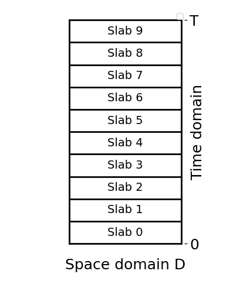
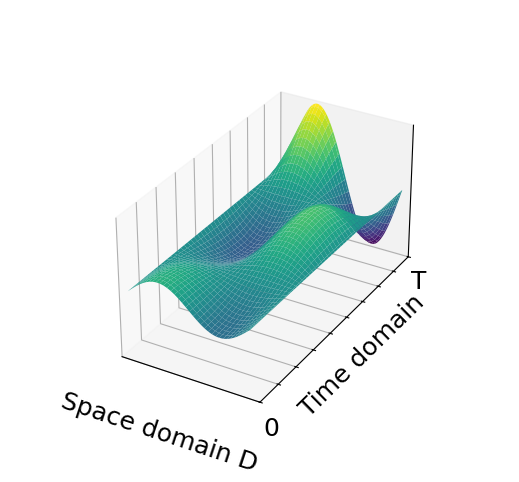

# CTG-wave: Continuous Time Galerkin for the (stochastic) wave equation

Continuous-Time Galerkin (CTG) space-time finite element method (FEM) for deterministic and stochastic wave equations.

<table>
  <tr>
    <td></td>
    <td></td>
  </tr>
  <tr>
    <td align="center">Space‑time slabs</td>
    <td align="center">Solution over space–time</td>
  </tr>
</table>


## Table of Contents
- [Features](#features)
- [QuickStart](#quickstart)
- [Installation](#installation)
- [Usage](#usage)
- [Contributing](#contributing)
- [License](#license)

## Features
- Continuous Time Galerkin (CTG) finite element methods for wave equations
- Space-time finite element discretization
- Parametric coefficient handling for uncertainty quantification
- Brownian motion coefficient implementation
- Efficient sparse matrix assembly for space-time operators
- Multiple examples and convergence studies
- Support for various boundary and initial conditions
- Post-processing and error analysis tools

## QuickStart
For those who have no time to lose:

```bash

# create and activate the conda environment
mamba env create -f environment.yml
conda activate ctg-wave

# install
pip install -e .

# Run default example (uses data in ctg/presets/swe.yaml)
ctg

# Or run with new custom data:
ctg --config-path examples/data_examples/data_swe.yaml

# run tests
pytest -q
```

The command produces results under `results/<timestamp>/` containing:

- `meta.json`: Simulation metadata and simple metrics on the output
- `config_used.yaml`: A copy of the configuration file containing problem data and solver parameters
- numerical outputs / plots

## Detailed Installation

1. Clone the repository
```sh
git clone git@github.com:andreascaglioni/CTG_wave.git
```

2. Install the dependencies with Mamba
```sh
mamba env create -f environment.yml
conda activate ctg-wave
```

**Note:** This package has only been tested with dolfinx v0.9.0.

3. Install the package + hooks
```sh
pip install -e .
pre-commit install
```

4. Run the CLI script with default parameters
```sh
python -m ctg.cli
```

5. Run Pytest tests (options set in `pyproject.toml`)
```sh
pytest
```

## Usage
The program can be run from the command line with a YAML file containing the physics and numerics data:
```sh
ctg --config-path [data/your_config.yaml]
```

If no YAML file is provided, the program will use a default file `ctg/default_data/data_swe.yaml`.

Give a look to it to understand how it is structured. Note that in the same directory there is a file `data_swe_functions.py` containing the callables referenced in `data_swe.yaml` (e.g., initial and boundary data functions).

More examples are available in the `examples/` directory:

- `examples/SWE_CTG_example.py` - Basic parametric wave equation example, similar to the CLI script
- `examples/WE_CTG_conv_dt.py` - Time step convergence study
- `examples/SWE_example_ensamble.py` - Ensemble simulation example

## Documentation
The documentation contains detailed API reference and mathematical background. Find it at https://andreascaglioni.github.io/ctg-wave/


## Contributing
Contributions are welcome! Please open an issue or submit a pull request.

## License
Distributed under the MIT License. See `LICENSE` for more information.

## Contact
Andrea Scaglioni - [Get in touch on my website](https://andreascaglioni.net/contacts)
